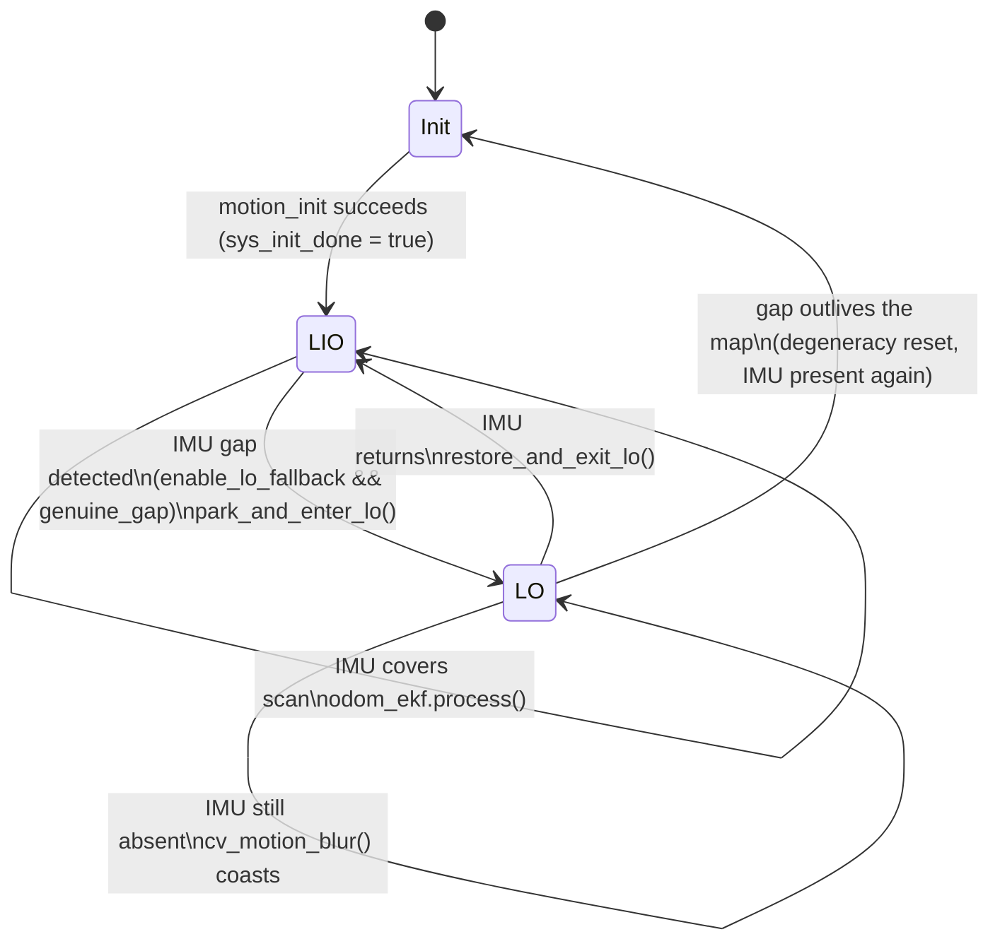

# Hybrid LIO / LO front-end

VoxelSLAM normally runs a tightly-coupled **LiDAR-inertial odometry (LIO)**
front-end. When the IMU stream drops out mid-run, the stock code stalls (it used
to `exit(0)` on an empty IMU buffer). The hybrid front-end detects that gap at
runtime and transparently switches to a **LiDAR-only (LO)** constant-velocity
predictor, then switches back the instant IMU returns.

**Design invariant:** when the IMU is continuously present, no LO path executes
and behaviour is bit-identical to stock. Every LO behaviour is gated on a
runtime-detected IMU gap **and** the config flag `enable_lo_fallback`.

## Mode state machine

`sync_packages()` (src/voxelslam.hpp) decides per scan whether the scan is
IMU-covered or LiDAR-only and returns that as `lo_scan`. The odometry loop
(`thd_odometry_localmapping`, src/voxelslam.cpp) edge-detects the transitions.

A scan is released **LiDAR-only** only when all of the following hold:

- `enable_lo_fallback` is true, and
- `sys_init_done` is true (the front-end has completed one successful init), and
- a **genuine gap** is evidenced: the scan is fully buffered (`pl_ready`) and
  `imu_last_time` has not reached `pcl_end_time`, while newer LiDAR is already
  queued past the last IMU sample (`time_buf.front() > imu_last_time`) or the
  buffered scans extend more than `imu_gap_thresh` past that last IMU sample.

Otherwise the sync simply waits (returns false) — the original latency
behaviour. The pre-init path is unchanged: **initialization still requires IMU.**

## Park / restore of the IMU state

At the LIO→LO transition the real inertial state is *parked* (saved) and the
EKF state vector is repurposed for the constant-velocity predictor; at LO→LIO it
is restored. The turn-rate `omega` is carried in the `bg` slot and the linear
velocity in `v` during LO.

| Phase | Action |
|-------|--------|
| **Saved on enter** (`park`) | `bg`, `ba`, `g`, `cov_bg = cov(9:12,9:12)`, `cov_ba = cov(12:15,12:15)` |
| **On enter LO** (`park_and_enter_lo`) | seed `bg = ` averaged pre-gap gyro (`last_frame_mean_gyr`); set a loose omega prior `cov(9:9) = cov_gyr_lo`, zero its cross-cov to rows/cols 0:9; **freeze** accel bias (`cov(12:12) = 1e-8·I`, zero cross-cov). `v` and `cov(v)` left untouched (shared across modes). |
| **On exit LO** (`restore_and_exit_lo`) | restore `bg`, `ba`, `g` and marginal `cov_bg`, `cov_ba`; **zero** the stale bias↔pose/vel cross-cov (rows/cols 9:15 vs 0:9); inflate velocity cov (`cov(6:6) += 0.25·I`). |

**Why the cross-covariance is RESET, not restored.** The off-diagonal blocks
coupling the bias states to pose/velocity were meaningful under LIO dynamics, but
during LO the `bg` slot no longer holds a gyro bias — it holds the CV turn-rate
`omega`, refined against LiDAR registration. Restoring the pre-gap cross terms
would re-inject correlations that no longer describe the current state and would
let LO-era LiDAR corrections leak into the restored biases. Zeroing them starts
LIO from an honest, decorrelated marginal; the first few IMU scans re-tighten the
velocity covariance (which is why it is deliberately inflated on exit).

## Averaged pre-gap gyro seed

The CV predictor needs a turn-rate to hold across the gap. Rather than the last
single noisy gyro sample, the enter-LO seed uses `last_frame_mean_gyr` — the
mean **bias-corrected** angular velocity over the last fully-IMU-covered frame
(~20 samples/frame). This is computed inside the normal `motion_blur` (it
accumulates `angvel_avr - bg` and divides by the sample count), so it is always
current at the moment the gap is detected.

## Mixed-window BA rule

The sliding-window optimizers (`LI_BA_Optimizer`, `LI_BA_OptimizerGravity` in
src/voxel_map.hpp) skip any `imus_factor[i]` that is `nullptr`. The odometry loop
uses that to build a **mixed** window:

- A **real** IMU pre-integration factor is pushed for an interval only when that
  interval is **fully IMU-covered**: `win_count > 1 && !lo_scan && !prev_lo_scan
  && !imus.empty()`.
- Any interval touching an LO scan pushes `nullptr` → that edge contributes only
  the LiDAR (pose) factors, no inertial constraint.

The marginalization pop guards the delete (`if(imu_pre_buf.front()) delete ...`),
and `system_reset` skips the IMU re-init when `imus` is empty, so an LO scan can
never crash the reset path. The degeneracy watchdog is also suppressed while
`lo_scan` is true (LO coasts on LiDAR instead of resetting).

## Parameters (`Odometry` namespace)

| Key | Default | Meaning |
|-----|---------|---------|
| `enable_lo_fallback` | `true` | Master switch: fall back to LiDAR-only CV mode when the IMU drops out. |
| `imu_gap_thresh` | `0.05` | Seconds of IMU silence past scan-end that declares a gap. |
| `lo_max_gap` | `5.0` | Seconds; an IMU gap longer than this should fall through to a reset. |
| `lo_cov_gyr` | `1.0` | CV process noise on the held turn-rate during LO, `(rad/s)^2`. |
| `lo_cov_acc` | `1.0` | CV process noise on velocity during LO, `(m/s^2)^2`. |
