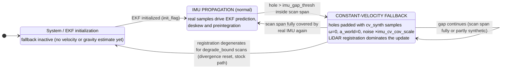
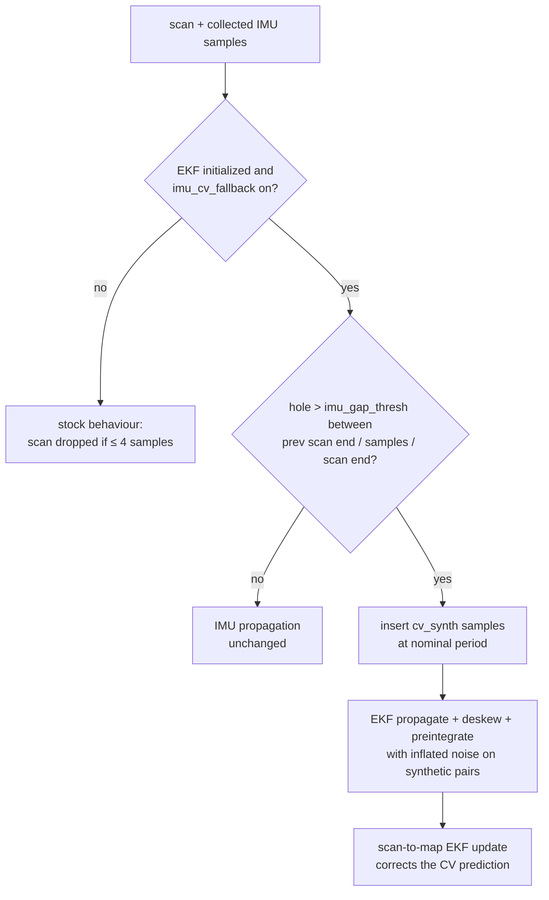

# Constant-Velocity Fallback for IMU Dropouts

## Problem

If the IMU stream has holes (e.g. logging loss of ~1.5 s), stock Voxel-SLAM
degrades in a hidden way: `sync_packages()` silently **drops every scan** whose
span is not covered by more than 4 IMU samples, and the first scan after the
hole is propagated from a ~1.5 s stale state. The registration usually still
"succeeds", absorbing a large pose error into the trajectory and local map.
The corrupted segment enters the pose graph with confident covariances, so the
next loop closure produces a large jump, and the rebuilt map is misaligned —
post-loop drift.

## Design

When a hole larger than `imu_gap_thresh` appears inside the current scan span,
`fill_imu_gaps()` (voxelslam.hpp) pads it with **synthetic IMU samples at the
nominal rate** that encode a constant-velocity motion model:

| quantity | synthetic value | effect after bias/gravity correction |
|---|---|---|
| angular velocity | `bg` (current gyro bias) | `ω = 0` → attitude `R` held constant |
| linear acceleration | `(ba − Rᵀ·g) / scale_gravity` | specific force cancels gravity → `a_world = 0`, so `v` constant, `p += v·dt` |

Because the padding consists of ordinary `sensor_msgs/Imu` messages (tagged
`frame_id = "cv_synth"`), **every downstream consumer works unchanged**:

- **EKF propagation** (`IMUEKF::motion_blur`) integrates them like real data,
  but pairs touching a `cv_synth` sample get their process noise inflated by
  `imu_cv_cov_scale` (default 100×), so the scan-to-map **LiDAR update
  dominates** the state correction during the gap — effectively LiDAR odometry
  with a CV prior.
- **Motion compensation (deskew)** uses the same propagated poses → linear
  interpolation across the scan, which is exactly the CV assumption.
- **Local-mapping BA preintegration** (`IMU_PRE::push_imu`) receives the padded
  stream, so the sliding-window IMU factors stay well-defined; the LiDAR plane
  factors constrain what the CV prior leaves open.
- The scan is **no longer dropped**: `sync_packages()` accepts under-covered
  scans whenever the fallback is enabled and the EKF is initialized.

## Switching states



Per-scan decision (inside the odometry loop, before `odom_ekf.process`):



The transition is logged on stdout:

```
IMU gap at scan t=...: constant-velocity fallback ON (N synthetic samples)
IMU stream recovered at t=...: back to IMU propagation
```

## Parameters (`Odometry` section)

| parameter | default | meaning |
|---|---|---|
| `imu_cv_fallback` | `false` | enable the fallback (stock behaviour when off) |
| `imu_gap_thresh` | `0.1` s | hole size that triggers padding; also the upper bound for the nominal-period estimator |
| `imu_cv_cov_scale` | `100.0` | process-noise inflation for synthetic pairs |

The nominal IMU period is estimated online (EMA over live inter-sample gaps
smaller than `imu_gap_thresh`), so no rate parameter is needed.

## Limitations

- Constant velocity is an assumption: during aggressive rotation inside a gap,
  deskew and the prior are wrong; the inflated noise lets registration correct
  the pose, but a long gap in feature-poor surroundings can still degenerate —
  in that case the stock divergence reset (new session + relocalization) takes
  over, which is the intended safety net.
- Gyro/accel biases are held constant through the gap (they are unobservable
  without real IMU data).
- The BA preintegration factors treat synthetic samples with nominal IMU noise
  (inflation currently applies to the EKF only); the window's LiDAR factors
  dominate in practice.
